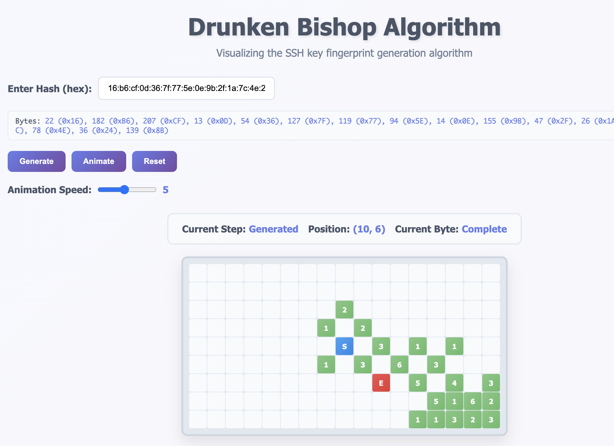

# Drunken Bishop Algorithm Animation

A JavaScript implementation and visualization of the Drunken Bishop algorithm, used for generating visual fingerprints of SSH keys and other cryptographic hashes.



## What is the Drunken Bishop Algorithm?

The Drunken Bishop algorithm is a method for creating visual representations of cryptographic fingerprints. It was introduced by Dirk Loss, Tobias Limmer, and Alexander von Gernler as a way to make SSH key fingerprints more memorable and easier to verify visually.

### How it works:

1. **Grid Setup**: Start with a 17×9 grid (153 fields total)
2. **Starting Position**: Begin at the center position (8, 4)
3. **Hash Processing**: For each byte in the hash:
   - Extract 4 pairs of 2 bits each
   - Use each pair to determine movement direction:
     - `00` = ↖ (up-left)
     - `01` = ↗ (up-right) 
     - `10` = ↙ (down-left)
     - `11` = ↘ (down-right)
4. **Movement**: Move the "bishop" according to the bit pairs, staying within grid bounds
5. **Counting**: Increment a counter for each position visited
6. **Visualization**: Display the final pattern with:
   - `S` marking the start position
   - `E` marking the end position
   - Numbers showing visit frequency
   - ASCII art representation using various characters

## Features

- **Interactive Animation**: Watch the algorithm execute step by step
- **Customizable Speed**: Adjust animation speed with a slider
- **Real-time Information**: See current position, step count, and byte being processed
- **Visual Feedback**: Color-coded cells show different states (empty, visited, current, start, end)
- **Sample Hashes**: Pre-loaded with example SSH key fingerprints
- **Responsive Design**: Works on desktop and mobile devices

## Getting Started

1. **Clone or download** this repository
2. **Open `index.html`** in a web browser
3. **Enter a hash** (colon-separated hex format) or use the default
4. **Click "Generate"** for instant results or **"Animate"** to watch the process
5. **Adjust speed** using the slider for comfortable viewing

## Example Hash Formats

```
16:b6:cf:0d:36:7f:77:5e:0e:9b:2f:1a:7c:4e:24:8b
4a:dd:0a:c6:35:4e:3f:ed:27:38:8c:74:44:e1:a3:2d
b1:94:73:d4:60:b4:b6:54:e5:c7:21:b2:24:93:49:fa
```

## Files Structure

```
drunken-bishop/
├── index.html          # Main HTML page
├── styles.css          # Styling and animations
├── drunken-bishop.js   # Core algorithm implementation
└── README.md          # This file
```

## Browser Compatibility

This project uses modern JavaScript features and CSS Grid. It's compatible with:
- Chrome 57+
- Firefox 52+
- Safari 10+
- Edge 16+

## Educational Value

This visualization helps understand:
- How cryptographic fingerprints are generated
- Bit manipulation and binary operations
- Pathfinding and boundary detection algorithms
- Visual representation of abstract data

## Contributing

Feel free to submit issues and pull requests. Some ideas for enhancements:
- Add more hash input formats
- Implement different grid sizes
- Add ASCII art export functionality
- Create additional visualization modes

## License

This project is open source and available under the MIT License.

## References

- [The Drunken Bishop: An Analysis of the OpenSSH Fingerprint Visualization Algorithm](https://www.usenix.org/legacy/events/lisa09/tech/full_papers/perrig/perrig_html/index.html)
- [OpenSSH Manual Pages](https://man.openbsd.org/ssh-keygen.1)
